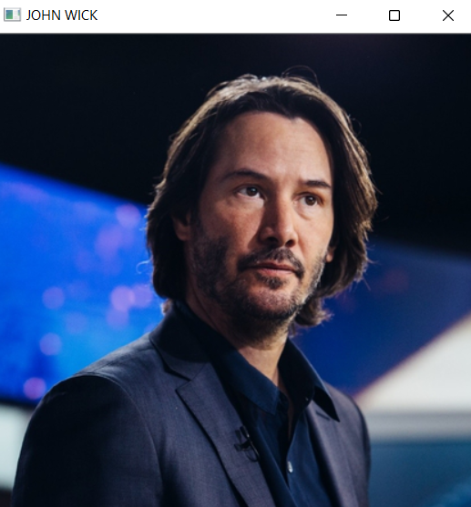
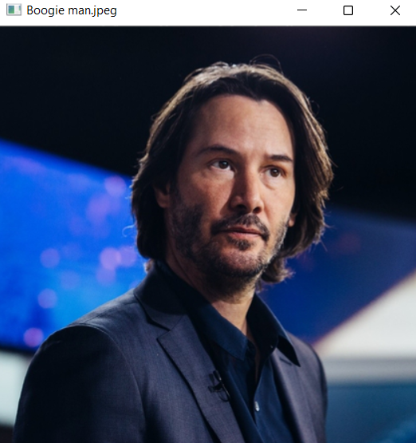
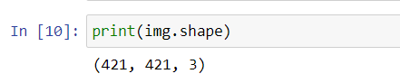
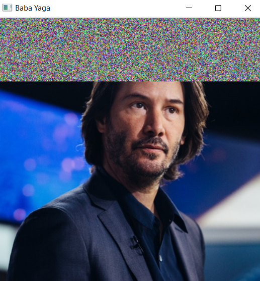
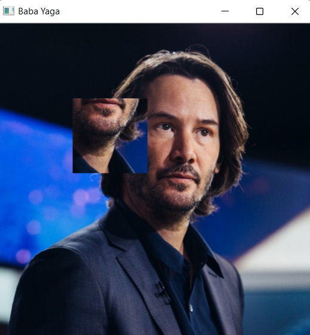

# READ AND WRITE AN IMAGE
## AIM
To write a python program using OpenCV to do the following image manipulations.
i) Read, display, and write an image.
ii) Access the rows and columns in an image.
iii) Cut and paste a small portion of the image.

## Software Required:
Anaconda - Python 3.7
## Algorithm:
### Step1:
Choose an image and save it as a filename.jpg
### Step2:
Use imread(filename, flags) to read the file.
### Step3:
Use imshow(window_name, image) to display the image.
### Step4:
Use imwrite(filename, image) to write the image.
### Step5:
End the program and close the output image windows.
## Program:
### Developed By:
### Register Number: 
i) #To Read,display the image
```
import cv2
img=cv2.imread('keanu.jpeg',1)
cv2.imshow('JOHN WICK',color_img)
cv2.waitKey(0)
cv2.destroyAllWindows()
```
ii) #To write the image
```
import cv2
img=cv2.imread('keanu.jpeg',1)
cv2.imwrite('Boogie man.jpeg',img)
img2=cv2.imread('Boogie man.jpeg')
cv2.imshow('Boogie man.jpeg',img2)
cv2.waitKey(0)
cv2.destroyAllWindows()
```
iii) #Find the shape of the Image
```
print(img.shape)
```
iv) #To access rows and columns

```
import random
for i in range(100):
    for j in range(img.shape[1]):
        img[i][j]=[random.randint(0,255),random.randint(0,255),random.randint(0,255)]

cv2.imshow("Baba Yaga",img)
cv2.waitKey(0)
cv2.destroyAllWindows()
```
v) #To cut and paste portion of image
```
import cv2
img=cv2.imread('keanu.jpeg',-1)
tag=img[200:300,200:300]
img[100:200,100:200]=tag
cv2.imshow('Baba Yaga',img)
cv2.waitKey(0)
cv2.destroyAllWindows()
```

## Output:

### i) Read and display the image


### ii)Write the image


### iii)Shape of the Image


### iv)Access rows and columns


### v)Cut and paste portion of image


## Result:
Thus the images are read, displayed, and written successfully using the python program.


